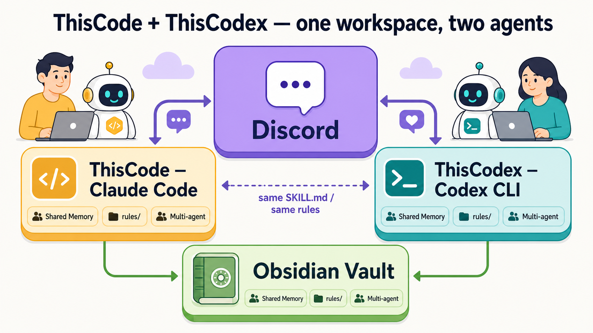

# ThisCode

> Claude Code + Discord 봇 + codex 호출 통합 플러그인 — 개인 vault 자동화 + 멀티에이전트 운영
>
> 🌐 **English version**: [README.md](README.md) · 📘 **Setup**: [docs/SETUP.md](docs/SETUP.md) (개발자) · 🌱 [docs/SETUP-BEGINNER.md](docs/SETUP-BEGINNER.md) (초보자) · 🧩 [docs/AGENTS.md](docs/AGENTS.md) (Custom Hybrid v1.0) · ⚙️ **[설정 가이드](docs/SETUP-CONFIG-GUIDE.md)** (CLAUDE.md · soul.md · rules · Skills 2.0) · 📄 **[전체 정리 한 장 (HTML)](docs/SUMMARY.html)** · 🤝 **[ThisCodex](https://github.com/treylom/ThisCodex)** (Codex 동반 런타임)



> **처음 오셨나요?** 이 그림 한 장이 전부입니다 — **디스코드**에서 Claude Code 봇(**ThisCode**)과 Codex 봇(**ThisCodex**)을 운영하고, 둘이 같은 옵시디언 볼트·메모리·규칙을 공유합니다. 사전 지식 없이 위 Setup 링크부터 따라오시면 됩니다.

WSL / Linux native / macOS 어느 환경이든 `bash install.sh` 한 줄로 Claude Code + tmux + oh-my-tmux 까지 세팅하고, Discord 봇 1개 띄워 첫 대화까지 검증하는 플러그인입니다.

## 🛠️ v2.3 Zero-config 설치 (NEW — 2026-05-13)

**Prerequisite:** Claude Code CLI 이미 install + auth 의무 (https://claude.ai/code). `install.sh` 의 `install-superpowers.sh` step 안 `claude` CLI 호출.

wizard 안 거치고 **single command 으로 install** 원하는 learner 용:

```bash
git clone https://github.com/treylom/ThisCode ~/.claude/plugins/thiscode
cd ~/.claude/plugins/thiscode
bash scripts/install.sh --apply
```

본 single command 안 install 되는 5 dep:

1. **superpowers** plugin (Claude Code plugin manager 호출)
2. **ripgrep** (Tier 4 baseline — brew / apt / dnf / apk 다 pkg manager fallback)
3. **Obsidian CLI** detect (Tier 3 — 미설치 시 manual download 안내)
4. **GraphRAG core** (Tier 1 — vendored Python runtime + 7-pkg pip install)
5. **Dense embedding** (옵션 4-channel — 사용자 confirm 1회, ~1GB)

Install 후: `bash scripts/healthcheck.sh` (6-phase 검증: superpowers + ripgrep + obsidian-cli + vault-search MCP + GraphRAG + Dense embedding).

**Windows 사용자:** WSL 2 (Ubuntu 22.04+) **required**. Native Windows (Cygwin / Git Bash / MSYS) 는 install.sh 안 detect 되며 WSL 사용 안내. PowerShell port = v2.4 후속 cycle.

**Dependency provenance:** 16 entries 매트릭스 (Plugin 1 + Spec doc 2 + External tools 8 + Optional Dense 3 + Vendored Python runtime 1 + thiscode 1) [ATTRIBUTIONS.md](ATTRIBUTIONS.md) 안 명기. Cross-license compatibility Phase 1 GPT-5.5 review 검증 (MIT + Apache 2.0 + BSD-3 + Unlicense — 모두 permissive, copyleft zero).

## 🚀 Quickstart (vault-first, v2.1)

```bash
# 1. thiscode 설치 (Claude Code plugin)
git clone https://github.com/treylom/ThisCode ~/.claude/plugins/thiscode

# 2. wizard 진입 — env 자동 감지 + Phase 추천
bash ~/.claude/plugins/thiscode/scripts/claude-discode-init.sh

# 또는 Claude Code 안에서
/thiscode:init
```

wizard 가 vault 상태 / 도구 / 자원 detect 후 **8 Phase progressive journey** 추천:
- **Phase 1-2**: 즉시 (ripgrep + obsidian-cli)
- **Phase 3**: 100+ 노트 → vault-search MCP 권유
- **Phase 4**: 500+ 노트 권유 / 1000+ strong / 옵션 언제나 (GraphRAG)
- **Phase 5**: 2000+ 노트 → km-at Mode R preflight (read-only 진단)
- **Phase 6-7**: advanced (Dashboard / 하이브리드 4채널)

> **GraphRAG = 환경 감지 + 선택사항** (사용자 spec). 노트 수 미충족 시도 force install 가능.

## 선택: Discord 봇 + Agent Teams

본 플러그인의 Discord 봇 및 Agent Teams 통합은 선택사항입니다. vault-first 검색만으로도 완전히 작동하며, Discord 페어링 및 tmux 세션은 advanced use case 용입니다.

---

## 📊 4-Tier Search Benchmark

thiscode 의 4-Tier search 가 일반 `obsidian-cli` / `/search` / `/vault-search` 대비 어떤 trade-off 를 보이는지 5-axis 로 측정합니다. **본인 vault 에서 직접 측정** 하면 본인 환경의 실제 trade-off 가 보입니다.

```bash
# 본인 vault 로 측정 (Tier 1 GraphRAG 사용 시 server 별도 띄움 필요)
VAULT=~/path/to/your/vault bash benchmark/runners/run-all.sh
python3 benchmark/report-generator.py --print-only
```

기대 범위 (참고용 — 실제 수치는 vault 크기 / 컨텐츠 / hardware 에 따라 다름):

| Tier | Method | latency_ms (P50) | recall@5 | cost_tokens | setup_time_min | kg_depth (avg) |
|------|--------|-------------------|----------|-------------|----------------|----------------|
| 1 | GraphRAG | 1500-3000 | 0.80-0.95 | ~2400 | 25 | 3-5 |
| 2 | vault-search MCP | 500-1000 | 0.60-0.80 | ~800 | 10 | 0 |
| 3 | Obsidian CLI | 200-500 | 0.50-0.70 | 0 | 5 | 0 |
| 4 | ripgrep | 30-100 | 0.30-0.50 | 0 | 0 | 0 |

> 측정 방법 + 해석 가이드 + 본인 vault fixture 작성: [docs/BENCHMARK.md](docs/BENCHMARK.md)
> CI 자동 측정 결과 (Tier 4 ripgrep + sample fixture only): [benchmark/results/](benchmark/results/)
>
> 본 표 의 수치는 다양한 vault 측정 데이터 합산 추정. CI 가 측정한 sample 결과는 strawman — 본인 vault 에서 의미 있는 수치 확인.

---

## 🧠 LLM 모델 routing (v2.0 신규)

thiscode 는 검색 결과 받은 후 응답 생성 시 task complexity 따라 모델을 자동 선택:

| Task | Claude 사용자 | GPT/[Codex](docs/GLOSSARY.md#codex) 사용자 |
|---|---|---|
| 단순 (factual lookup) | Haiku | gpt-5.5 |
| 중간 (요약 / 분류) | Sonnet | gpt-5.5-codex |
| 종합 (multi-doc 추론) | Opus[1m] | gpt-5.5-opus |

`scripts/route-model.mjs` heuristic — query length / 키워드 기반. user override `--model haiku|sonnet|opus`.

**Tier 순서 (v2.0 정정):** Tier 1 [GraphRAG](docs/SETUP.md#tier-1) → Tier 2 [vault-search MCP](docs/SETUP.md#tier-2) → Tier 3 [Obsidian CLI](docs/SETUP.md#tier-3) → Tier 4 [ripgrep](docs/SETUP.md#tier-4). 정확도 우선 fallback.

## 📚 용어 모르겠으면? → [GLOSSARY.md](docs/GLOSSARY.md)

30+ 용어 풀이 (LLM / MCP / CEL / embedding / recall@5 / kg_depth / fallback / dispatcher / 등).

---

## 🚀 빠른 시작 (3 step)

### Step 1. 환경 인식 + 자동 설치

```bash
curl -fsSL https://raw.githubusercontent.com/treylom/ThisCode/main/install.sh | bash
```

또는 git clone 후 로컬 실행:

```bash
git clone https://github.com/treylom/ThisCode.git ~/code/thiscode
cd ~/code/thiscode && bash install.sh
```

`install.sh` 가 10 step 자동 수행:

| 단계 | 작업 | 의존 |
|---|---|---|
| 1 | OS / Distro detect (WSL / Linux / macOS) | uname |
| 2 | 필수 패키지 (tmux + git + curl + jq + build-essential) | apt / dnf / yum / brew / pacman |
| 3 | nvm + Node.js LTS | curl |
| 4 | Claude Code 전역 설치 | npm |
| 4.5 | **Codex CLI** (`@openai/codex`) 전역 설치 — codex 호출 layer 의존 | npm |
| 5 | oh-my-tmux (`gpakosz/.tmux`) 자동 install | git |
| 6 | (선택) thiscode `tmux.conf.local` 적용 | user confirm |
| 6.5 | **Obsidian CLI** (Mac brew cask / WSL Windows native / Linux snap·flatpak·deb) — 3-Tier 폴백 1순위 | brew / snap / 수동 |
| 7 | Claude Code plugin install 안내 (marketplace 등록 + 슬래시 7종) | (Claude Code 안 슬래시) |
| 8 | 첫 봇 wizard 안내 (`/thiscode:start`) | (Claude Code 안 슬래시) |

플러그인 install 후 자동 인식되는 슬래시 7종:
- `/thiscode:start` — 메인 wizard (환경 인식 + 봇 셋업 + 첫 대화)
- `/thiscode:install-hooks` — SessionStart + UserPromptSubmit hook merge (~/.claude/settings.json 안전 병합, 기존 hook 보존)
- `/thiscode:create-bot` — 신규 봇 디렉토리 + .env + soul.md template 자동 셋업
- `/thiscode:add-bot` — 추가 봇 1개 신설
- `/thiscode:open-meeting` — 회의실 폴더 신설 (다 봇 협업 4-file)
- `/thiscode:codex-check` — Codex CLI 검증 (호출 layer 활성 확인)
- `/thiscode:self-update` — 자가 업데이트 체크 (git fetch behind 비교)

순정 Claude Code 부트스트랩 (hook + 봇 없는 상태):

```
1. /thiscode:install-hooks   # SessionStart + UserPromptSubmit hook 등록
2. /thiscode:create-bot      # 첫 봇 디렉토리 + soul.md 셋업
3. /thiscode:start           # 메인 wizard (Discord 페어링 + 첫 대화 검증)
4. /thiscode:codex-check     # Codex CLI 활성 확인 (선택)
```

## 📦 운영 노하우 가이드 (docs/)

thiscode 가 packaging 한 우리 vault 운영 노하우:

- [03-shared-memory.md](docs/03-shared-memory.md) — **공유 메모리 4-tier** (T1 git-tracked / T2 machine-specific / T3 project-meetings / T4 per-bot WD)
- [04-obsidian-cli.md](docs/04-obsidian-cli.md) — **Obsidian CLI 설정** (Mac brew / WSL Windows native / Linux snap·flatpak·deb) + 3-Tier 폴백 (CLI → MCP → Write/Read/Grep) + 알려진 버그·워크어라운드
- [06-claude-code-server.md](docs/06-claude-code-server.md) — **Claude Code 서버 기능** (`claude -p` 헤드리스 + MCP server + tmux session vs headless 분리 패턴)
- [08-debug-노하우.md](docs/08-debug-노하우.md) — **디버깅 24+ 카테고리** (Workflow / Code Review / Vault Path / 회의 protocol / Security / Time / LLM Prompt / Schedule / Plugins / External Apps / Cross-bot SoP)
- (예정) `05-meeting-thread-protocol.md` — 회의 신설 SOURCE FACT cross-check + Discord REST API thread + audience direct mention + 3-channel 병행 보고
- (예정) `07-codex-호출-layer.md` — `/tofu-at-codex` v2.2 + codex-exec-bridge 패턴 + Hermes 호환 subprocess plugin

### Step 2. Claude Code 인증

```bash
claude auth login    # 🐧 👤 → 브라우저 인증
```

### Step 3. 첫 봇 wizard 시동

```bash
tmux new-session -s claude                # 🐧 👤
cd ~/<project> && claude                  # 🐧 🤖
```

Claude Code 안에서:

```
/thiscode:start                     # 🤖 wizard 진입
```

wizard 가 단계별 안내:
- Discord 봇 생성 (Developer Portal 이동)
- 봇 토큰 입력
- 첫 봇 페르소나 결정 (`soul.md` template)
- 페어링 + 첫 대화 검증

---

## 📚 커맨드 범례

본 레포의 코드블록에 자주 등장하는 아이콘:

| 아이콘 | 의미 |
|---|---|
| 🖥️ | Windows PowerShell |
| 🐧 | WSL Ubuntu / Linux 터미널 |
| 🤖 | Claude Code 가 자동 실행 |
| 👤 | 사용자가 직접 입력 |
| ✅ | 성공 |
| ❌→✅ | 실패 후 수정 |

---

## 🧩 레포 구조

```
thiscode/
├── install.sh                            # 환경 자동 detect + 10-step 자동화
├── README.md                              # 영문판 (default, 글로벌 강의 대비)
├── README.ko.md                           # 본 파일 (한국어, v2.1 vault-first)
├── LICENSE                                # MIT
├── CODEX_REVIEW.md                        # Codex 1차 adversarial review
├── CODEX_VERIFY.md                        # Codex 2차 verify (회복 후)
├── .claude-plugin/
│   ├── marketplace.json                   # thiscode-marketplace
│   └── plugin.json                        # thiscode v0.1.0
├── commands/                              # 슬래시 7종
│   ├── start.md                           # 메인 wizard (4-step 부트스트랩)
│   ├── install-hooks.md                   # SessionStart + UserPromptSubmit hook merge
│   ├── create-bot.md                      # 봇 디렉토리 + soul.md 자동 셋업
│   ├── add-bot.md
│   ├── open-meeting.md
│   ├── codex-check.md
│   └── self-update.md
├── skills/                                # 12 skill (v2.2 vault-mirror 정책)
│   ├── knowledge-manager/                 # vault 풀 7-Layer Fusion (1161 줄)
│   ├── knowledge-manager-at/              # Agent Teams 변종 (1189 줄)
│   ├── knowledge-manager-lite/            # Lite 단일 에이전트 (530 줄)
│   ├── knowledge-manager-bootstrap/       # 4-Tier install 합본
│   ├── knowledge-manager-plain/           # headless variant
│   ├── search/                            # 4-Tier vault search
│   ├── search-lite/                       # 3-Tier (GraphRAG 의존 없음)
│   ├── codex-exec-bridge/                 # vault skill mirror (폴더)
│   ├── init/                              # v2.1 wizard skill
│   ├── bootstrap/                         # plugin 설치 wizard
│   ├── meetings/                          # 회의실 4-file protocol
│   └── shared-memory/                     # 4-tier 메모리 정책
├── hooks/                                 # 봇 운영 hook 3종
│   ├── bot-session-init.sh                # SessionStart → soul.md 자동 inject
│   ├── discord-slash-cmd.sh               # UserPromptSubmit → 슬래시 강제
│   └── regression-self-check.sh           # 4-gate self-check 표 주입
├── templates/                             # 봇 페르소나 template
│   ├── soul-general-assistant.md          # default 범용 비서
│   ├── soul-research-bot.md               # 자료조사·교차검증
│   ├── soul-writing-bot.md                # 글쓰기·퇴고
│   ├── soul-schedule-bot.md               # 일정·Todo·알람
│   ├── soul-custom.md                     # 자유 페르소나 + anatomy 가이드
│   └── discord-state-dir-README.md        # DISCORD_STATE_DIR 환경변수 구조
├── configs/                               # 우리 색깔 tmux.conf.local 등
│   └── tmux.conf.local
└── docs/                                  # 한국어 친절 가이드 (Zettelkasten 톤)
    ├── 03-shared-memory.md                # 4-tier 메모리
    ├── 04-obsidian-cli.md                 # 3-Tier 폴백
    ├── 06-claude-code-server.md           # headless + MCP server
    └── 08-debug-노하우.md                  # 디버깅 24+ 카테고리
```

---

## 🎯 사용 시나리오

### 시나리오 A. 새 머신 zero-state 셋업

WSL Ubuntu 또는 macOS 새로 깔린 머신에서, Claude Code 환경 처음 만들 때.

```bash
curl -fsSL https://raw.githubusercontent.com/treylom/ThisCode/main/install.sh | bash
```

### 시나리오 B. 봇 1개 추가 운영

이미 Claude Code 사용 중인 사용자가 Discord 봇으로 자기만의 페르소나 운영 시작.

- 첫 봇 `soul.md` 작성 (wizard 가 template 제공)
- Discord 봇 생성 + 페어링
- tmux session 운영 패턴 학습

### 시나리오 C. 신규 도입자 — 자기 속도로

처음 도입하는 사용자가 본 레포를 그대로 따라하며 자기 머신에 Claude Code + 봇 환경 셋업.

---

## 🔧 호환성

| 환경 | 지원 | 비고 |
|---|---|---|
| **WSL Ubuntu 20.04+** | ✅ primary | `install.sh` 가장 잘 테스트된 환경 |
| **Linux native** (Debian / Ubuntu / Fedora / Arch) | ✅ | 패키지 매니저 자동 detect |
| **macOS** | ✅ | brew 기반 |
| **Windows native** | ❌ | WSL 사용 권장 |

| Agent runtime | 호환 | 비고 |
|---|---|---|
| **Claude Code** | ✅ primary target | Anthropic 공식 CLI |
| Hermes Agent (NousResearch) | 🟡 부분 | SKILL.md 는 portable, Hermes plugin wrapper 는 추후 (deferred) |
| Codex CLI / Cursor / Gemini CLI / Goose 등 | 🟡 SKILL.md 만 | agentskills.io 표준 채택 — `name + description` 호환 |

---

## ⚠️ 트러블슈팅

### `nvm: command not found`

`source ~/.bashrc` 로 안 될 수도 있음. 새 터미널을 **완전히 닫고 다시 열기**.

### `permission denied` on `install.sh`

```bash
chmod +x install.sh
./install.sh
```

또는 `bash install.sh` 로 권한 없이도 실행.

### tmux 중첩 오류 (`sessions should be nested with care`)

이미 tmux 안에서 `claude` 실행한 경우. `Ctrl+B → c` 로 새 window 사용 (`ain` 함수가 자동 처리).

### git push rejected

원격에 다른 commit 이 있어 충돌:

```bash
git pull --rebase
git push
```

### Discord 봇 페어링 코드 만료

봇에 다시 DM → 새 코드 발급.

### GraphRAG 서버가 안 뜨는 경우 (v2.3 — vendor 의존 + ~/.cache venv)

```bash
bash scripts/install-graphrag.sh --check     # python3 + vendor SoT + requirements + venv + server health
bash scripts/install-graphrag.sh --preflight # Python 3.10+ / disk 5GB+ / port 8400 / vendor SoT 점검
bash scripts/install-graphrag.sh --apply     # venv 생성 + pip install + nohup uvicorn
```

`--apply` 의 동작 (v2.3):
- venv 위치 = `~/.cache/thiscode/graphrag/venv` (writable home cache)
- vendor SoT = `<thiscode>/vendor/graphrag/scripts/` (vault SoT 와 동등 박제, 21 file)
- requirements = `vendor/graphrag/scripts/requirements.txt` (7 deps: networkx / louvain / pyyaml / fastapi / uvicorn / numpy / httpx)
- entry = `uvicorn search_server:app --host 127.0.0.1 --port 8400` (background nohup)
- log = `~/.cache/thiscode/graphrag/run/graphrag.log`

---

## 🤝 기여

본 레포는 `treylom` 의 vault 운영 경험 종합. 

- PR / issue 환영
- 디버깅 노하우 공유 환영
- 강의 수강생 피드백 환영

---

## 📄 라이선스

MIT — 자유 사용 / 자유 수정 / 자유 재배포.

상세: [LICENSE](LICENSE)

---

## 🔗 관련 자원

- **gpakosz/.tmux** (oh-my-tmux): https://github.com/gpakosz/.tmux
- **agentskills.io** (SKILL.md open standard): https://agentskills.io
- **Anthropic Claude Code**: https://www.anthropic.com/claude-code
- **NousResearch/hermes-agent**: https://github.com/NousResearch/hermes-agent
