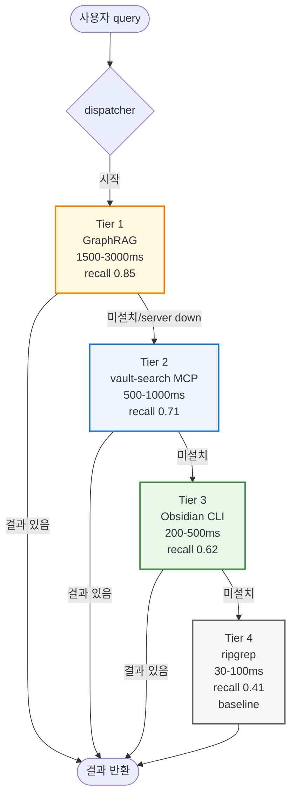
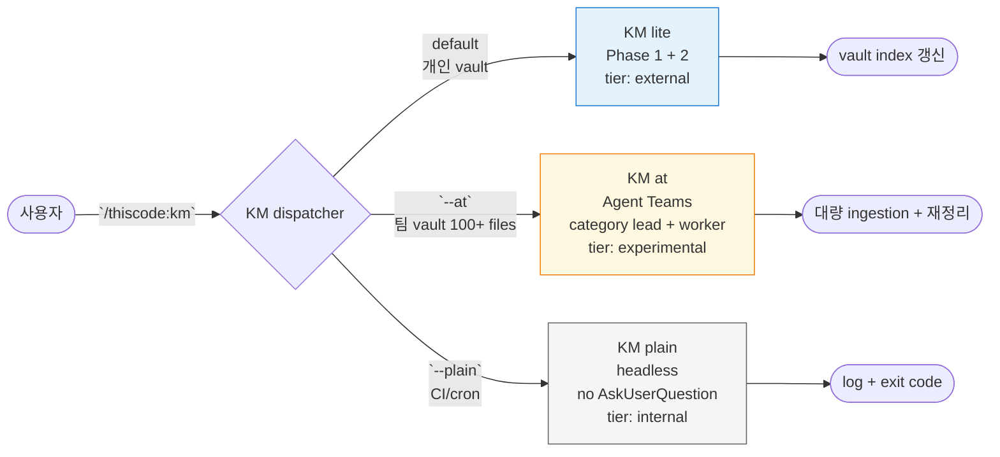
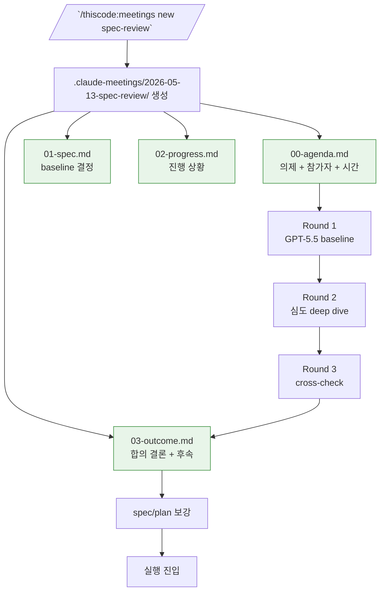
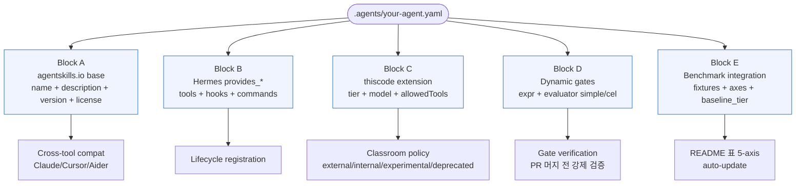
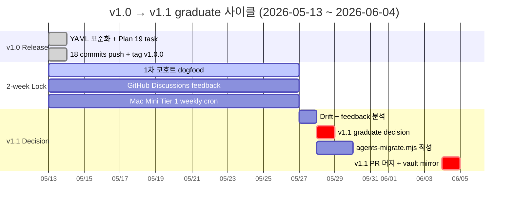
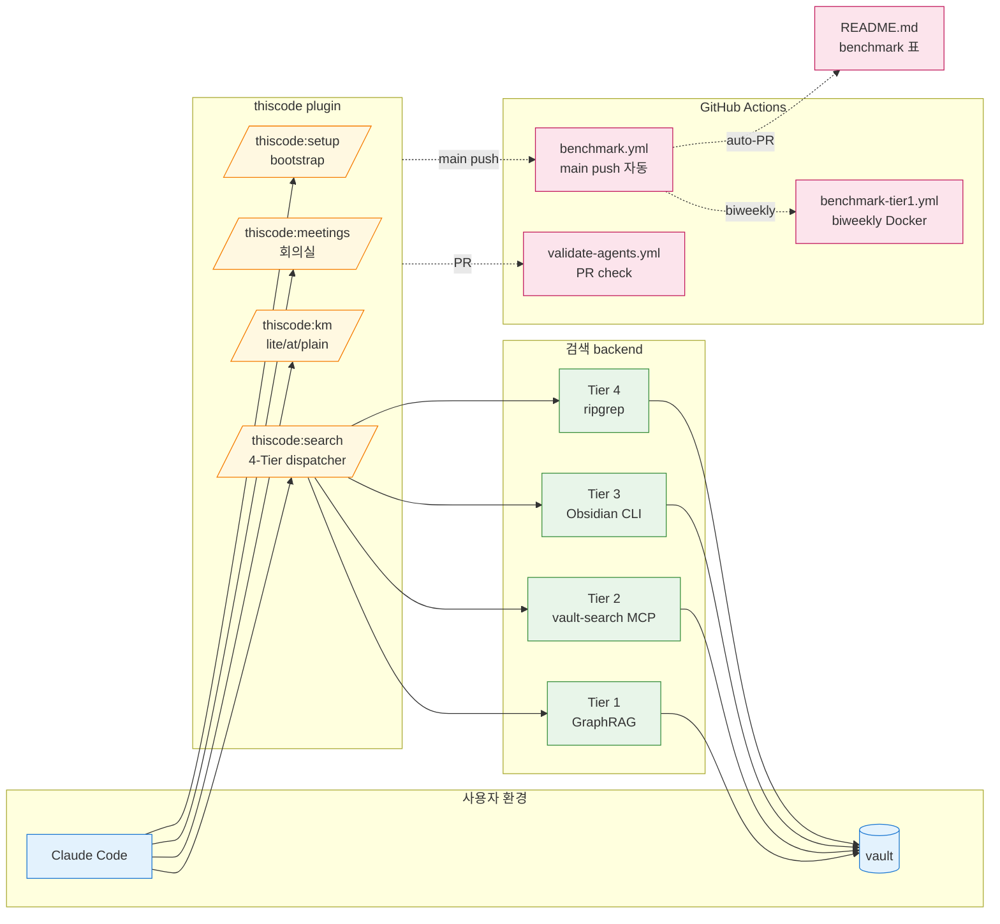

# Architecture — thiscode v1.0

thiscode 의 구조 + 흐름을 mermaid 차트로 시각화. GitHub 에서 자동 render — 별도 도구 불필요.

## 1. 4-Tier Search Fallback

검색 dispatcher 가 빠른 도구부터 시도 + 결과 부족 시 더 정확한 도구로 fallback.

각 Tier 는 독립 설치 가능 — Tier 4 만 깔아도 즉시 작동. 학생이 강의 따라가며 점진적으로 Tier 3 → 2 → 1 추가.

---

## 2. KM 3 variants — 언제 어떤 걸 쓰나

---

## 3. 회의실 4-file Lifecycle

다 봇 협업 회의 시 회의록 폴더 + 4-file template 자동 셋업.

본 매뉴얼 자체가 outcome 예시: `.claude-meetings/2026-05-13-thiscode-yaml-v1.0/` → 3 라운드 GPT-5.5 토론 → 12 decisions → v1.0 spec 확정 → 19 task 실행 → release.

---

## 4. Custom Hybrid YAML — 5 Block 구조

`.agents/<name>.yaml` 한 파일이 5 block 으로 구성됨.

각 Block 책임 분리 — Block A 만 cross-tool portable, Block C/D/E 는 thiscode 전용 extension.

---

## 5. v1.0 → v1.1 Graduate Timeline

Graduate trigger 3 조건 (Round 3 outcome):
1. benchmark/results 3주 연속 metric ±20% 이상 drift
2. GitHub Discussions feedback "재현 성공률 ⚠️/❌" 3건 이상
3. `tier1-stale > 14 days` badge 14일 지속

---

## 6. 전체 통합 (요약)

---

## 관련 문서

- [README.md](../README.md) — 5-axis benchmark 표 + 빠른 시작
- [SETUP.md](SETUP.md) — 개발자용 5단계 셋업
- [SETUP-BEGINNER.md](SETUP-BEGINNER.md) — 초보자용 분기 친절 + FAQ
- [SETUP-BEGINNER.typ / .pdf](SETUP-BEGINNER.typ) — 인쇄용 typst PDF
- [MANUAL.typ / .pdf](MANUAL.typ) — 13 sections 완전 매뉴얼
- [AGENTS.md](AGENTS.md) — Custom Hybrid v1.0 spec
- [BENCHMARK.md](BENCHMARK.md) — 5-axis 측정 방법 + 해석
