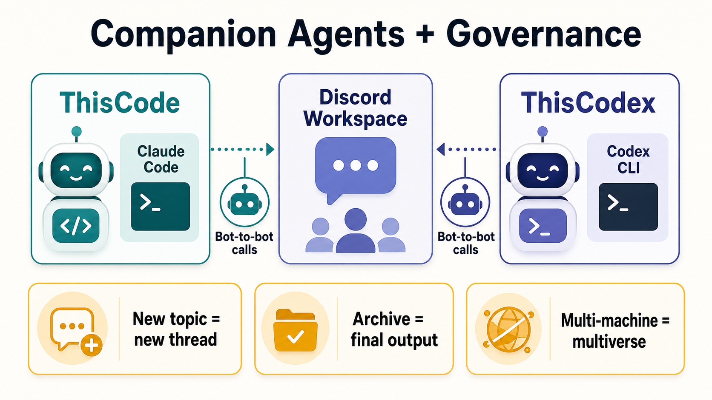
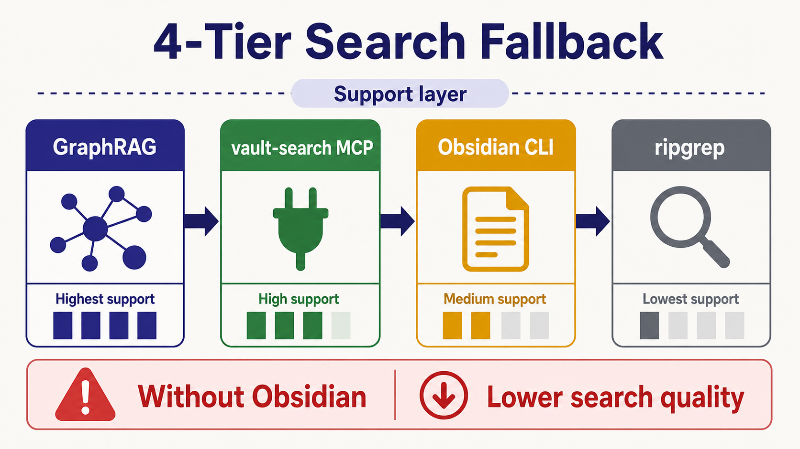

# Setup → Config Guide — wiring your bot's brain

> After [SETUP.md](SETUP.md) installs thiscode, **this guide configures the bot's
> behavior**: the three config surfaces a bot reads, in what order, and how to
> author each one. It is a *hub* — it links to the existing templates/specs
> instead of repeating them (the same progressive-disclosure idea the rules
> system uses: load depth only when you need it).
>
> Hard English terms are glossed in parentheses on first use, for non-developer
> readers. 🇰🇷 Korean mirror at the bottom (`## 한국어`).

## In one minute (plain words)

New here and not a developer? Think of your bot as a **new teammate**:

- **CLAUDE.md / AGENTS.md / GEMINI.md** = their *one-page job sheet* — what the project is, where they sit, and "check the handbook when the situation calls for it." Keep it short.
- **soul.md** = their *personality & voice* — copy a ready-made template, fill the blanks.
- **rules/** = the *company handbook* — they do NOT memorize it; they open the one page that matches the moment.

You do three things: (1) put one job sheet, (2) pick a personality template, (3) point at the handbook. That is the whole setup. Everything below is just the detail of those three.

> **Don't want to hand-write any of it?** Run **§0 guided onboarding** — the
> installing AI designates your workspace, installs the skill plugin, scans the
> workspace, and drafts the three files *for* you via an interview. §1-§6 then
> become reference, not homework.

## §0 — Guided onboarding (first run — recommended)


This is the path for a non-developer. The installing AI runs it **once**, and
the output is a finished `CLAUDE.md` + `soul.md` per bot — produced by the
bundled `/prompt` skill and a short `/using-superpowers` interview, not
hand-written. §1-§6 below are the manual equivalent if you'd rather author by
hand or audit what the AI produced.

### Prerequisites (do these first, in order)

**0a. Designate the workspace.** The installing AI asks you, in plain words:

- *"Which folder is your Obsidian vault / overall workspace?"* — the root the
  bots search and store into (**working directory** = 작업 폴더, the folder a
  bot "lives in").
- *"For each bot you want, what is its working directory?"* — one bot = one
  working directory; that folder is where that bot's `CLAUDE.md` + `soul.md`
  go.

The AI can pre-fill candidates instead of guessing —
`bash scripts/claude-discode-init.sh --detect-only` autodiscovers a likely
vault path + note count + RAM/disk; the AI shows it and you confirm or
correct. A wrong vault root mis-scopes every later step, so this is asked
**before** anything is scanned or written.

**0b. Install the superpowers plugin** (so the `/prompt` and
`/using-superpowers` skills the next steps need are loadable — a **plugin** =
플러그인, an add-on bundle of skills):

```bash
bash scripts/install-superpowers.sh --apply   # wraps: claude plugin install superpowers@claude-plugins-official
bash scripts/install-superpowers.sh --check    # verify (exit 0 = present)
```

`install.sh --apply` already runs this first, so if you ran the top-level
installer it is done. The bundled `skills/prompt/` itself ships **inside this
repo** — superpowers adds `/using-superpowers` (the interview driver).

### The guided flow (the installing AI executes this)

1. **Scan the designated workspace.** For the vault root and each bot working
   directory, the AI reads: folder structure (top ~2 levels), any existing
   `CLAUDE.md`/`AGENTS.md`/`soul.md`, a *sample* of notes for dominant topics
   (it does not slurp the whole vault), and which Discord channel/role each
   bot will own. This grounds the draft in your *actual* workspace, not a
   generic template.
2. **Auto-invoke `/prompt` to draft the two meta files.** For each bot working
   directory, the AI **must** invoke the bundled `skills/prompt/` skill
   (force-invoke — see §6; never hand-roll) to produce: a thin
   `CLAUDE.md`/`AGENTS.md` (the job sheet — §1 shape) and a `soul.md` seeded
   from the closest `templates/soul-*.md` (the persona — §2 shape). `/prompt`
   is mandatory here precisely because these two files *are* prompts (the
   bot's standing instruction); ad-hoc authoring is the exact regression §6
   exists to stop.
3. **Run the `/using-superpowers` advancement interview.** The AI invokes
   `/using-superpowers`, which routes to the brainstorming skill to interview
   you and refine the drafts — **one decision at a time**, not a wall of
   questions: this bot's role/scope (owns vs. delegates) · persona & voice
   (template, signature, forced self-check lines) · model id (a real id your
   harness exposes — not invented) · Discord surface (channel/thread, mention
   id, meeting-thread governance) · vault scope (search/write paths;
   Obsidian-present vs. Obsidian-less). Answers are written back into the
   drafts; the meta file is then pointed at `rules/INDEX.md` (rules are never
   inlined — §3).
4. **Verify before declaring done.** `soul.md` frontmatter valid · signature
   line present · meta file points *only* at `rules/INDEX.md` · `/prompt` was
   actually entered (not free-handed). Then you continue with the normal §4
   "how to ask" flow.

**Obsidian-less path:** if at 0a you opt out of Obsidian, steps 0b-3 still
run, but vault scope is marked *connectivity-only* and the AI tells you
memory / internal-search quality is **not guaranteed** (mirrors the README
"Before you start").

### Force-invoke wiring (so a bot actually runs §0 on first setup)

So this is not skippable, wire it the same way §6 wires `/prompt`:

- In `CLAUDE.md`/`AGENTS.md`, under the rules pointer, one line: *"First run /
  unconfigured working dir → MUST run SETUP-CONFIG-GUIDE §0 guided onboarding
  (designate workspace → install superpowers → scan → `/prompt` draft →
  `/using-superpowers` interview) before normal work."*
- Or a `rules/INDEX.md` row:
  `First run / WD has no soul.md | onboarding.md | Run SETUP-CONFIG-GUIDE §0: workspace → superpowers → scan → /prompt → /using-superpowers`

## The three config surfaces (and load order)


A thiscode bot composes its behavior from three files, loaded in this order:

```
1. CLAUDE.md / AGENTS.md / GEMINI.md   ← project + bot working-dir meta. Points
   (always loaded; harness-specific)     ONLY at rules/INDEX.md (not the rules).
        ↓
2. soul.md                              ← persona / voice / model meta.
   (SessionStart hook auto-injects it)    Pick a templates/soul-*.md, fill it.
        ↓
3. rules/INDEX.md                       ← progressive-disclosure (load only the
   (router; topical files on demand)      rule that the current situation needs)
        ↓
   memory / meetings                    ← run-time state, not config
```

**single source of truth** (단일 기준 출처 — one place each fact lives): each
surface owns a distinct concern. Do not copy rules into `CLAUDE.md` or `soul.md`
— that is the context-bloat failure the rules system exists to prevent.

| Surface | Harness | What it owns | Author from |
|---|---|---|---|
| `CLAUDE.md` | Claude Code | project meta + bot-WD meta + INDEX pointer | §1 below |
| `AGENTS.md` | Codex (see [ThisCodex](https://github.com/treylom/ThisCodex)) | same role, Codex side | §1 below |
| `GEMINI.md` | Gemini CLI | same role, Gemini side | §1 below |
| `soul.md` | all (SessionStart inject) | persona, voice, signatures, model | §2 → `templates/` |
| `rules/` | all (on-demand) | situational operating rules | §3 → [rules-system.md](https://github.com/treylom/ThisCodex/blob/master/docs/rules-system.md) |

## §1 — CLAUDE.md / AGENTS.md / GEMINI.md (the meta file)

This file is **always in context**, so keep it thin. It carries: (a) what the
project is, (b) the bot's working-directory role, (c) the **load order above**,
and (d) a single pointer to `rules/INDEX.md` — never the rule bodies.

Minimal template (same shape for AGENTS.md / GEMINI.md — just the filename
differs per harness):

```markdown
# <Project> — bot working-dir meta

This dir is both the project root and **<BotName>'s working dir**. On a bot
session, load in order:

0. ./CLAUDE.md (this file — project + bot-WD meta)
1. <path>/soul.md (persona · voice · model)
2. rules/INDEX.md (situational rules — Read the matched topic file on demand)
3. meetings/<date>-<topic>/ (current task context)

**Bot meta**: <BotName> (`<@discord-id>`) · <one-line role> · model `<id>` ·
WD `<abs-path>`.

## Operating rules = rules/ (progressive disclosure)
Every turn: self-check rules/INDEX.md trigger table → Read the matched row's
file → apply. Conflict priority: **explicit user instruction > rule file >
inline default**.
```

Gotchas:
- The pointer block must be the *only* rules content here. If a rule starts
  growing inline, move it to `rules/<topic>.md` and leave one INDEX row.
- Tool-managed auto-blocks (e.g. an installer's marker block) stay where the
  tool regenerates them — moving them causes the tool to re-add and conflict.

## §2 — soul.md (persona / voice / model)

Do not write this from scratch. thiscode ships fillable templates:

| Template | For |
|---|---|
| [`templates/soul-custom.md`](../templates/soul-custom.md) | blank anatomy (11 sections, fill what fits) |
| [`templates/soul-general-assistant.md`](../templates/soul-general-assistant.md) | general helper |
| [`templates/soul-research-bot.md`](../templates/soul-research-bot.md) | research / source-tracing |
| [`templates/soul-writing-bot.md`](../templates/soul-writing-bot.md) | writing persona |
| [`templates/soul-schedule-bot.md`](../templates/soul-schedule-bot.md) | scheduling / reminders |

Steps:
1. Copy the closest template to your bot's working dir as `soul.md`.
2. Fill the **frontmatter** (문서 맨 위 `---` 메타 블록 — `name`, `description`,
   `version`, `triggers`). The SessionStart hook reads this to auto-inject.
3. Keep the **forced-persona self-check table** and the **completion signature**
   (`— <BotName>`) — signature absence is the #1 persona-regression symptom.
4. Set the model meta to a real model id your harness exposes.

The persona is enforced *per response*, not just declared — the self-check
table at the top of every template is what makes it stick.

## §3 — rules/ (progressive-disclosure operating rules)

Full convention (problem, pattern, how-to-add, Codex variant):
**[rules-system.md](https://github.com/treylom/ThisCodex/blob/master/docs/rules-system.md)**
— the canonical copy lives in the ThisCodex companion repo. Read it once; do
not duplicate it here.

회의 스레드·채널·대화기록 보관 거버넌스: [05-meeting-thread-protocol.md](05-meeting-thread-protocol.md) (정책 SoT = vault rules/channel-governance.md — 새 주제=새 스레드 / 보관=최종 산출만 / 기기간=멀티버스).



Minimal worked example — a bot that must always reply via a channel tool:

`rules/INDEX.md` (router — the only file the meta file points at):
```markdown
| Trigger (when this situation) | Rule file | One-line gist |
|---|---|---|
| Replying to an external channel | discord-comms.md | Use the reply tool; terminal text never reaches the user |
```
`rules/discord-comms.md` (loaded only when that row matches):
```markdown
# Rule: external-channel reply
- The user reads the channel, not your terminal transcript. Send via the
  channel reply tool. Terminal-only output = user never sees it.
```
Each turn: scan INDEX triggers → match → Read that one file → apply. No match →
proceed. Rules are paid for (in context) only when relevant.

## §4 — How to set up & how to ask (first run)



After install + the three files above:

```
/thiscode:setup            # (re)configure tiers
/thiscode:search "..."     # 4-Tier vault search
```

Example prompts and what to expect:

| You ask | The bot does |
|---|---|
| "Summarize my notes on attention mechanisms" | vault search (Tier 1→4 fallback) → grounded summary with source paths |
| "Set yourself up as a scheduling bot" | reads `templates/soul-schedule-bot.md`, helps you fill `soul.md` |
| "Why did you do X?" | answers from the loaded soul + the rule that applied (it tells you which) |

If a reply seems off-persona or ignores a rule: check (a) `soul.md` frontmatter
is valid, (b) the situation actually matches a `rules/INDEX.md` trigger row.

## §5 — Skills 2.0 conformance checklist

Any skill you add under `skills/<name>/SKILL.md` should pass these (the standard
that keeps skills discoverable + token-efficient):

- [ ] **Frontmatter present** — `---` block with `name` + `description`
- [ ] `name:` is **kebab-case**, matches the directory
- [ ] `description:` is **third-person** and uses a **"Use when …"** trigger phrase
- [ ] **SKILL.md ≤ 500 lines** — heavy detail goes to `references/` (progressive
      disclosure: load depth on demand)
- [ ] **Directory structure** — every skill dir has a `SKILL.md` (no orphan dirs)
- [ ] **No broken references** — every `references/` link resolves
- [ ] **Imperative form** — body says "Run", "Check" (not "you should …")
- [ ] **Reference-type skills** (guide/spec/templates/examples) set
      `disable-model-invocation: true` so they are not auto-triggered

This checklist **is** the conformance standard (Anthropic Skills 2.0 — the
12-check rubric: frontmatter, name, description, ≤500 lines, directory
structure, invocation control, no orphans/broken refs, progressive disclosure,
imperative form). Walk every box manually before a push. Also grep the diff
for hardcoded user paths / secrets before any push (see the privacy lesson in
this repo's history) — never publish without that scan.

## §6 — Force-invoke the `/prompt` skill

The bundled `skills/prompt/` skill must be **mandatorily invoked** for any
prompt-authoring work (writing/refining a prompt, GPTs/Gems instructions,
fact-check/research/image prompting) — never free-hand a prompt.

Wire the enforcement into the bot's config so it cannot be skipped:

- In `CLAUDE.md` / `AGENTS.md` (the always-loaded meta), add one line under the
  rules pointer: *"Prompt-authoring tasks → MUST invoke the `prompt` skill
  before producing any prompt (no ad-hoc prompts)."*
- Or add a `rules/INDEX.md` row: `Producing a prompt for a model | prompt-skill.md | Invoke skills/prompt first; never hand-roll`.
- In `soul.md`, the forced-persona self-check table is the right place for a
  hard rule (see `templates/soul-custom.md` — a `/prompt` enforcement line is
  included there).

Why a hard rule: prompt quality regresses to ad-hoc without enforced routing;
the skill's frameworks (IFCN fact-check base, 5-stage image, GPTs/Gems
structure) are only applied if the skill is actually entered.

## Stuck? — friendly FAQ

**Q. The bot ignores its personality / signature.**
A. Open `soul.md`. Is the top `---` block (frontmatter) filled and valid? Is the completion-signature line still there? Missing signature is the #1 cause.

**Q. The bot did not follow a rule I expected.**
A. A rule only loads when its trigger row in `rules/INDEX.md` matches the situation. Check that a row actually describes your case; if not, add one.

**Q. Where do I put these files?**
A. The job sheet (`CLAUDE.md`/`AGENTS.md`) at the project/bot root; `soul.md` in the bot working dir; `rules/` next to it. The load order at the top of this guide shows the sequence.

**Q. Do I really need Obsidian?**
A. For full memory + internal search, yes — recommended. Without it a plain Discord bot still works for basic connectivity, but memory/search quality is not guaranteed (see the README "Before you start").

**Q. What model id do I write in soul.md?**
A. A real id your tool exposes (e.g. an Opus/Sonnet/Haiku id for Claude Code, a gpt-5.x id for Codex). Not a made-up name.

**Q. It still feels overwhelming.**
A. Do only the three steps in "In one minute" first. Skip §1-§6 detail until something breaks; this guide is a reference, not a checklist to finish in one sitting.

## See also

- [SETUP.md](SETUP.md) — install (this guide is what comes *after*)
- [SETUP-BEGINNER.md](SETUP-BEGINNER.md) — non-developer install walkthrough
- [AGENTS.md](AGENTS.md) — the `.agents/*.yaml` skill/command spec (different layer)
- [ThisCodex](https://github.com/treylom/ThisCodex) — the Codex-side companion runtime

---

## 한국어

[SETUP.md](SETUP.md) 설치 **후**, 봇 행동을 설정하는 가이드입니다. 봇이 읽는
세 설정 표면과 **로딩 순서**, 각 작성법을 묶어 줍니다. 깊은 내용은 기존
템플릿·스펙 문서로 링크(필요할 때만 펼치는 progressive disclosure — 점진적
노출 — 방식, rules 시스템과 동일 철학). 어려운 영어 용어는 첫 등장에 풀이.

### §0 가이드 온보딩 (첫 실행 — 권장, 비개발자용 경로)

직접 안 쓰고 싶으면 이 경로. 설치하는 AI 가 **한 번** 실행하고, 결과물은
봇별 완성된 `CLAUDE.md` + `soul.md` — 번들된 `/prompt` 스킬과 짧은
`/using-superpowers` 인터뷰가 만들어 줍니다(손으로 안 씀). 아래 §1~§6 은
손수 작성/감수하고 싶을 때의 수동 대응판.

**선행(이 순서로 먼저):**

- **0a. 작업공간 지정.** 설치 AI 가 평이하게 물어봄: ① "옵시디언 볼트 /
  전체 작업 폴더가 어디예요?"(봇이 검색·저장하는 루트 — **working
  directory** = 작업 폴더) ② "원하는 봇마다 작업 폴더가 어디예요?"(봇 1개 =
  작업 폴더 1개, 그 폴더에 그 봇의 `CLAUDE.md`+`soul.md` 가 들어감). 추측
  대신 `bash scripts/claude-discode-init.sh --detect-only` 로 볼트 후보·노트
  수·RAM/디스크 자동탐지 → 보여주고 사용자가 확인/수정. 볼트 루트가 틀리면
  이후 전 단계가 어긋나므로 **스캔·작성 전에** 먼저 물어봄.
- **0b. superpowers 플러그인 설치**(다음 단계가 쓰는 `/prompt`·
  `/using-superpowers` 스킬 로드용 — **plugin** = 플러그인, 스킬 묶음
  애드온): `bash scripts/install-superpowers.sh --apply` (확인:
  `--check`, exit 0=설치됨). `install.sh --apply` 가 이미 맨 처음 실행하므로
  상위 설치 스크립트를 돌렸다면 완료 상태. 번들 `skills/prompt/` 는 **본
  레포 안에 동봉**, superpowers 는 인터뷰 구동용 `/using-superpowers` 를 추가.

**가이드 흐름(설치 AI 가 실행):**

1. **지정 작업공간 스캔** — 볼트 루트 + 각 봇 작업폴더의 폴더 구조(상위 ~2
   레벨)·기존 `CLAUDE.md`/`AGENTS.md`/`soul.md`·노트 *샘플*(전체 흡입 ❌)
   주제·담당 Discord 채널/역할을 읽음. 일반 템플릿이 아니라 *실제*
   작업공간에 근거.
2. **`/prompt` 자동 호출로 메타 2파일 초안** — 봇 작업폴더마다 번들
   `skills/prompt/` 스킬을 **반드시** 호출(force-invoke, §6 — 손으로 짜기
   금지)해 얇은 `CLAUDE.md`/`AGENTS.md`(업무지시서, §1 형태) + 가장 가까운
   `templates/soul-*.md` 기반 `soul.md`(페르소나, §2 형태) 생성. 이 두
   파일이 곧 prompt(봇 상시 지시)이므로 `/prompt` 강제 — 즉흥 작성이 §6 이
   막으려는 회귀.
3. **`/using-superpowers` 고도화 인터뷰** — `/using-superpowers` 호출 →
   brainstorming 스킬로 라우팅돼 사용자 인터뷰로 초안 정련. **한 번에 한
   결정씩**(질문 폭탄 ❌): 이 봇의 역할/범위(직접 vs 위임) · 페르소나·말투
   (템플릿·서명·자가점검 줄) · 모델 id(harness 가 실제 노출하는 id, 지어냄
   ❌) · Discord 표면(채널/스레드·mention id·회의 스레드 거버넌스) · 볼트
   범위(검색/쓰기 경로, 옵시디언 유/무). 답을 초안에 반영 후 메타 파일을
   `rules/INDEX.md` 로 포인팅(규칙 inline ❌ — §3).
4. **완료 선언 전 검증** — soul.md frontmatter 유효 · 서명 줄 존재 · 메타
   파일이 `rules/INDEX.md` *만* 가리킴 · `/prompt` 실제 진입(즉흥 ❌). 이후
   §4 "질문 방법" 흐름으로.

**옵시디언 없는 경로:** 0a 에서 옵시디언 미사용 선택 시 0b~3 은 그대로
실행하되 볼트 범위=연결 전용 표시 + 메모리/내부검색 품질 미보장 안내
(README "Before you start" 와 동일).

**강제 호출 배선(봇이 첫 셋업에 §0 을 실제 실행하도록):** §6 가 `/prompt`
배선하는 것과 동일하게 — `CLAUDE.md`/`AGENTS.md` 규칙 포인터 아래 한 줄:
*"첫 실행 / 미설정 작업폴더 → 일반 작업 전 SETUP-CONFIG-GUIDE §0 가이드
온보딩(작업공간 지정 → superpowers 설치 → 스캔 → `/prompt` 초안 →
`/using-superpowers` 인터뷰) 필수 실행."* 또는 `rules/INDEX.md` 행 1개:
`첫 실행 / WD 에 soul.md 없음 | onboarding.md | SETUP-CONFIG-GUIDE §0 실행: 작업공간→superpowers→스캔→/prompt→/using-superpowers`

### 세 설정 표면 + 로딩 순서

`CLAUDE.md/AGENTS.md/GEMINI.md`(프로젝트+봇 WD 메타, 항상 로드 — **rules/INDEX.md
만 가리킴**) → `soul.md`(페르소나·말투·모델, SessionStart 훅이 자동 주입) →
`rules/INDEX.md`(라우터, 상황 매칭 시 해당 토픽 파일만 그때 Read) → 메모리/회의록.

**single source of truth(단일 기준 출처)**: 각 표면은 서로 다른 관심사를
소유합니다. 규칙을 CLAUDE.md/soul.md 에 복붙하지 마세요 — 그게 rules 시스템이
막으려는 context 비대화입니다.

### §1 메타 파일 (CLAUDE/AGENTS/GEMINI)
항상 context 에 있으므로 얇게. (a) 프로젝트 (b) 봇 WD 역할 (c) 위 로딩 순서
(d) `rules/INDEX.md` 포인터 1개 — 규칙 본문 금지. 템플릿은 위 영문 §1 코드블록
참고(파일명만 harness 별로 다름: Claude=CLAUDE.md, Codex=AGENTS.md, Gemini=GEMINI.md).

### §2 soul.md
직접 쓰지 말고 `templates/soul-*.md` 5종 중 가장 가까운 걸 봇 WD 에 `soul.md`
로 복사 → frontmatter(문서 맨 위 `---` 메타 블록) 채움 → 자가점검 표 + 완료
서명(`— <봇이름>`) 유지(서명 부재 = 페르소나 소실 1순위 신호) → 모델 메타를
harness 가 실제 노출하는 모델 id 로.

### §3 rules/
전체 컨벤션 = [rules-system.md](https://github.com/treylom/ThisCodex/blob/master/docs/rules-system.md)
(정본은 ThisCodex 동반 레포에 있음, 중복 작성 금지). 매 턴 INDEX 트리거 표
스캔 → 매칭 행 파일 그때 Read → 적용.
충돌 우선순위 = **사용자 명시 지시 > rule 파일 > inline 기본**.

### §4 설정·질문 방법
설치 후 `/thiscode:setup`, `/thiscode:search "질의"`. 예: "내 attention 노트
요약" → 4-Tier 검색 후 출처 경로 포함 요약. 응답이 페르소나/규칙을 벗어나면
soul.md frontmatter 유효성 + INDEX 트리거 매칭을 점검.

### §5 Skills 2.0 체크리스트
`skills/<name>/SKILL.md` 추가 시: frontmatter 존재 · `name` kebab-case ·
`description` 3인칭 + "Use when …" · SKILL.md ≤500줄(초과분 `references/`) ·
orphan 디렉토리 없음 · 깨진 reference 없음 · 명령형 어조 · reference형 스킬은
`disable-model-invocation: true`. **본 체크리스트가 곧 표준**(Anthropic
Skills 2.0 12-check 루브릭). push 전 매 항목 수동 확인 + diff 에서 하드코딩
경로·시크릿 grep 검사 필수(본 레포 history 의 privacy 교훈 — 미검사 publish 금지).

### 1분 설명 (비개발자용)

봇을 **새 팀원**이라고 생각하세요:
- `CLAUDE.md/AGENTS.md/GEMINI.md` = 한 장짜리 **업무 지시서**(프로젝트가 뭔지·어디 앉는지·"상황 맞으면 매뉴얼 펴봐"). 짧게.
- `soul.md` = **성격·말투**. 완성 템플릿 복사 후 빈칸 채우기.
- `rules/` = **사내 매뉴얼**. 통째로 외우지 않고, 그 순간에 맞는 한 페이지만 펴봄.

할 일 3개: ① 지시서 1장 ② 성격 템플릿 1개 ③ 매뉴얼 가리키기. 이게 전부입니다. 아래는 그 3개의 세부일 뿐.

### 막히면? — 자주 묻는 질문

- **봇이 성격/서명을 무시해요** → `soul.md` 맨 위 `---` 블록 채워졌는지 + 완료 서명 줄 남아있는지 (서명 누락이 1순위 원인).
- **기대한 규칙을 안 따라요** → 규칙은 `rules/INDEX.md` 트리거 행이 상황과 맞을 때만 로드. 내 상황 설명하는 행 있는지 확인, 없으면 추가.
- **파일 어디 둬요?** → 지시서=프로젝트/봇 루트, `soul.md`=봇 작업폴더, `rules/`=그 옆. 맨 위 로딩 순서 그림 참고.
- **옵시디언 꼭 필요해요?** → 메모리·내부검색 제대로 쓰려면 권장. 없이도 단순 연결은 되지만 품질 미보장.
- **모델 id 뭘 써요?** → 도구가 실제 노출하는 id(Claude=Opus/Sonnet/Haiku id, Codex=gpt-5.x id). 지어낸 이름 ❌.
- **너무 복잡해요** → 위 "1분 설명" 3단계만 먼저. 뭔가 깨지기 전엔 §1~§6 세부 skip. 이 문서는 한 번에 끝낼 체크리스트가 아니라 참조용.
